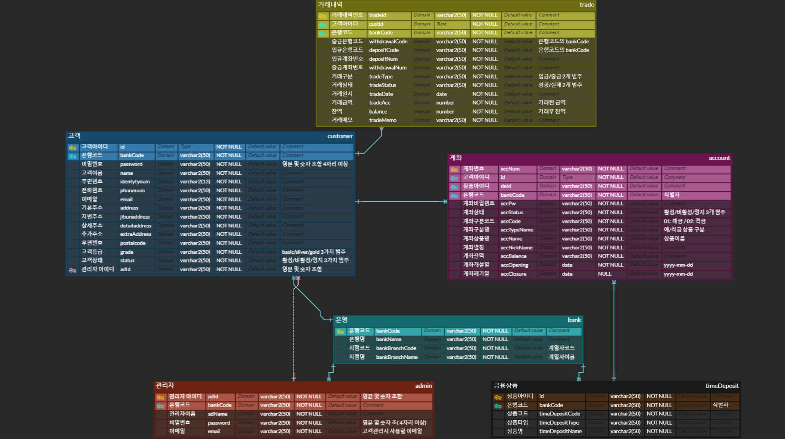

# 과목명 
웹개발프로젝트 - 오픈뱅킹 1조

 
# 목차
 - ch01. 프로젝트 소개
 - ch02. 발표 ppt 및 영상
 - ch03. 조원 소감

 
# ch01 - 프로젝트 소개
4개의 개별 은행 시스템과 오픈 API 시스템을 구축하여 금융 데이터를 개방적으로 공유 및 통합하는 프로젝트

 
# ch02 - 발표 ppt 및 영상

## 프로젝트 전체 일정
    

## 프로젝트 아키텍처
    

## 아키텍처 설계
    

## 오픈API
    

## 개별은행기능
    

## ERD 다이어그램
    

## 발표 ppt
   [발표자료 Download](오픈뱅킹1조_웹개발프로젝트.pptx)

 
# ch03. 조원 소감
  - 협업 하는 방법을 좀 알아야겠다. 깃이나 애자일같은 프로젝트 기획방법을 고민해봐야겠다.  
  - 작년 선배의 깃을 참고해도 다른 방식으로 진행하는 프로젝트여서 쉽지 않았지만 그래서인지 더더욱 얻는 것이 많았던거 같다. 
  - 프로젝트를 통해 필요 기능을 정의하고 서비스를 구현하며 개발 과정에 대한 이해를 높일 수 있었던 좋은 기회였다. 또한, 그동안 학습했던 자바, SQL, 웹 개발 등을 함께 적용해 보며 개발 프로세스에 대한 이해를 향상시킬 수 있었다. 
  - 산출물과 화면설계서의 중요성을 알게 되었다.  
  - 개발 프로젝트를 진행하면서, 회의를 통한 소통 외에도 설계서 작성의 중요성과, 그것을 기반으로한 개발의 중요성을 알게 되었다.  
  - 서로 어떤 부분을 구현하였고, 어떤 부분이 보완이 필요한지 서로 소통하며, 협업하는 방법을 배우는 기회였다.  
